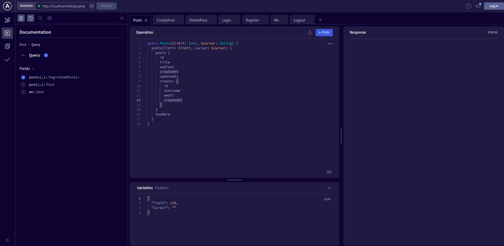

**Note**: This project is useful to learn Apollo GraphQL and TypeORM with Typescript for beginner.

# Features

- Basic Session Authentication.
- Building GraphQL queries and muations using a decorator `@Resolver` from `type-graphql` to the regular typescript class.
  **This project allows users to login, register, post their blogs, and read them**
  **This project uses [pnpm](https://pnpm.io/) as the package manager, so you have to install it**

# Preinstallation

- Nodejs,
- PostgreSQL

```shell
docker pull postgres
docker run --name your-postgresql-container-name -e POSTGRES_PASSWORD=postgres -d -p 5432:5432 postgres
```

- Redis

```shell
docker pull redis
docker run --name your-redis-container-name -p 6379:6379 -d redis
```

This project assumes that you have preinstalled these packages on your machine.
If you didn't do it yet, I recommend you to intall them using Docker.

# Project Setup

```shell
pnpm install
```

And There are several peer dependencies requried to install manually, so you have to install them manually.
If you installed all the dependencies, it's time to run this project now.

```shell
pnpm watch
pnpm dev
```

And open the web browser, go to the http://localhost:4000/graphql
If everything is okay, you have to see the same image below.


